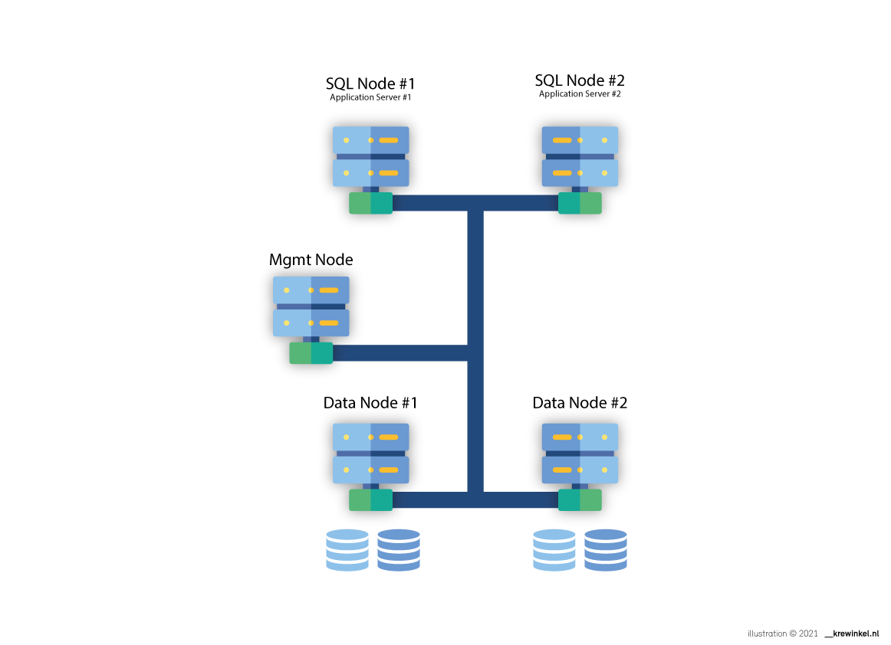
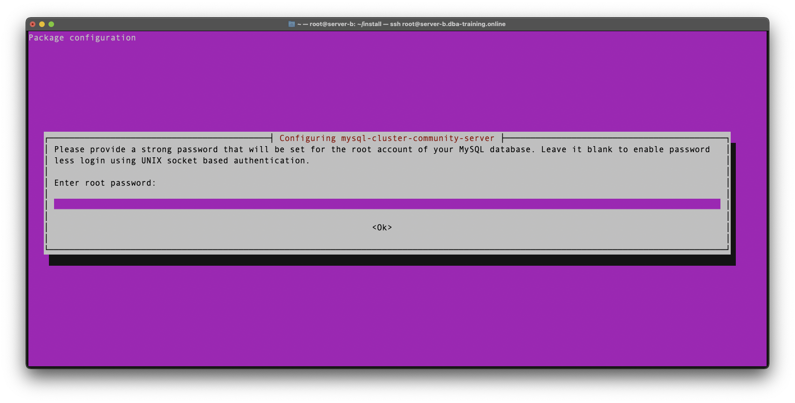

# Install MySQL Cluster on Ubuntu 18.04

I've adapted this [original post](https://www.digitalocean.com/community/tutorials/how-to-create-a-multi-node-mysql-cluster-on-ubuntu-18-04#step-1-—-installing-and-configuring-the-cluster-manager) for training purposes. Credits & Big Shout Out to [Toli](https://www.digitalocean.com/community/users/tollodim) and [Hanif Jetha](https://www.digitalocean.com/community/users/hjet)

## Architecture



> **Note:** Login as `root` on the specified systems. 
> If you don't have access to the root account issue `sudo` before each subsequent command.

## 1 — Installing and Configuring the Cluster Manager  
We’ll first begin by downloading and installing the MySQL Cluster Manager, `ndb_mgmd`
To install the Cluster Manager, we first need to fetch the appropriate .deb installer file from the the official [MySQL Cluster download page](http://dev.mysql.com/downloads/cluster/).

````  
wget https://dev.mysql.com/get/Downloads/MySQL-Cluster-7.6/mysql-cluster-community-management-server_7.6.6-1ubuntu18.04_amd64.deb  
````

Next, install `ndb_mgmd` using `dpkg`:
````
dpkg -i mysql-cluster-community-management-server_7.6.6-1ubuntu18.04_amd64.deb
````

We now need to configure ```ndb_mgmd``` before first running it; proper configuration will ensure correct synchronization and load distribution among the data nodes.

The Cluster Manager should be the first component launched in any MySQL cluster. It requires a configuration file, passed in as an argument to its executable. We’ll create and use the following configuration file: ```/var/lib/mysql-cluster/config.ini```.

On the Cluster Manager Server, create the ```/var/lib/mysql-cluster``` directory where this file will reside:
````
mkdir /var/lib/mysql-cluster
````

Then create and edit the configuration file using your preferred text editor:
```
vi /var/lib/mysql-cluster/config.ini
```
Paste the following text into your editor (change the IP addresses to your specific environment).
```
[ndbd default]
# Options affecting ndbd processes on all data nodes:
NoOfReplicas=2  # Number of Data Nodes

[ndb_mgmd]
# Server D Manager
hostname=185.57.8.218 
datadir=/var/lib/mysql-cluster  

[ndbd]
# Server E - Data Node 1 NodeId: 2
hostname=185.57.8.198 
NodeId=2            
datadir=/usr/local/mysql/data   

[ndbd]
# Server F - Data Node 2, NodeId: 3
hostname=185.95.14.193 
NodeId=3            
datadir=/usr/local/mysql/data  

[mysqld]
# Server B: SQL node 1:
hostname=37.128.150.147

[mysqld]
# Server C: SQL node 2:
hostname=37.128.150.252
```
After pasting in this text, being sure to replace the hostname values above with the correct IP addresses of the servers you’ve configured. Setting this hostname parameter is an important security measure that prevents other servers from connecting to the Cluster Manager.

Save the file and close your text editor.

This is a pared-down, minimal configuration file for a MySQL Cluster. You should customize the parameters in this file depending on your production needs. For a sample, fully configured ndb_mgmd configuration file, consult the [MySQL Cluster documentation](https://dev.mysql.com/doc/mysql-cluster-excerpt/5.7/en/mysql-cluster-config-starting.html).

In the above file you can add additional components like data nodes (ndbd) or MySQL server nodes (mysqld) by appending instances to the appropriate section.

We can now start the manager by executing the ndb_mgmd binary and specifying its config file using the ```-f``` flag:

```
ndb_mgmd -f /var/lib/mysql-cluster/config.ini
```

You should see the following output:
```
2021-12-29 11:58:04 [MgmtSrvr] INFO     -- The default config directory '/usr/mysql-cluster' does not exist. Trying to create it...
2021-12-29 11:58:04 [MgmtSrvr] INFO     -- Sucessfully created config directory
```
This indicates that the MySQL Cluster Management server has successfully been installed and is now running on your server.

Ideally, we’d like to start the Cluster Management server automatically on boot. To do this, we’re going to create and enable a systemd service.

Before we create the service, we need to kill the running server:
```
 pkill -f ndb_mgmd
```

Now, open and edit the following systemd Unit file using your favorite editor:
```
vi /etc/systemd/system/ndb_mgmd.service
```

Paste in the following code:
```
[Unit]
Description=MySQL NDB Cluster Management Server
After=network.target auditd.service

[Service]
Type=forking
ExecStart=/usr/sbin/ndb_mgmd -f /var/lib/mysql-cluster/config.ini
ExecReload=/bin/kill -HUP $MAINPID
KillMode=process
Restart=on-failure

[Install]
WantedBy=multi-user.target
```

Here, we’ve added a minimal set of options instructing systemd on how to start, stop and restart the ```ndb_mgmd``` process. To learn more about the options used in this unit configuration, consult the [systemd manual](https://www.freedesktop.org/software/systemd/man/systemd.service.html).

Save and close the file.

Now, reload systemd’s manager configuration using ```daemon-reload```:

```
# Reload Daemon
systemctl daemon-reload  

# Enable service
systemctl enable ndb_mgmd  

# Start service
systemctl start ndb_mgmd

# Check status
systemctl status ndb_mgmd

# Output
● ndb_mgmd.service - MySQL NDB Cluster Management Server
   Loaded: loaded (/etc/systemd/system/ndb_mgmd.service; enabled; vendor preset: enabled)
   Active: active (running) since Fri 2021-12-29 11:59:20 UTC; 3s ago
  Process: 14473 ExecStart=/usr/sbin/ndb_mgmd -f /var/lib/mysql-cluster/config.ini (code=exited, status=0/SUCCESS)
 Main PID: 14486 (ndb_mgmd)
    Tasks: 11 (limit: 1152)
   CGroup: /system.slice/ndb_mgmd.service
           └─14486 /usr/sbin/ndb_mgmd -f /var/lib/mysql-cluster/config.ini

Dec 29 11:59:20 server-d systemd[1]: Starting MySQL NDB Cluster Management Server...
Dec 29 11:59:20 server-d ndb_mgmd[14473]: MySQL Cluster Management Server mysql-5.7.22 ndb-7.6.6
Dec 29 11:59:20 server-d systemd[1]: Started MySQL NDB Cluster Management Server.
```

Which indicates that the ndb_mgmd MySQL Cluster Management server is now running as a systemd service.

The final step for setting up the Cluster Manager is to allow incoming connections from other MySQL Cluster nodes on our private network.

If you did not configure the ufw firewall when setting up this server, you can skip ahead to the next section.

We’ll add rules to allow local incoming connections from all nodes:

```
ufw allow from 37.128.150.147
ufw allow from 37.128.150.252
ufw allow from 185.57.8.218
ufw allow from 185.57.8.198
ufw allow from 185.95.14.193
```

After entering these commands, you should see the following output:
```
Rule added

or

Rules updated
```

The Cluster Manager should now be up and running, and able to communicate with other Cluster nodes over the network.


## 2 — Installing and Configuring the Data Nodes

> **Note:** All the commands in this section should be executed on both data nodes.

In this step, we’ll install the ndbd MySQL Cluster data node daemon, and configure the nodes so they can communicate with the Cluster Manager.

To install the data node binaries we first need to fetch the appropriate .deb installer file from the [official MySQL download page](http://dev.mysql.com/downloads/cluster/).

From this page, under Select Operating System, choose Ubuntu Linux. Then, under Select OS Version, choose Ubuntu Linux 18.04 (x86, 64-bit).

Scroll down until you see DEB Package, NDB Data Node Binaries, and click on the Download link for the one that does not contain dbgsym (unless you require debug symbols). You will be brought to a Begin Your Download page. Here, right click on No thanks, just start my download. and copy the link to the .deb file.

Now, log in to your first data node (in this tutorial, `185.57.8.198`), and download this .deb file:
```
wget https://dev.mysql.com/get/Downloads/MySQL-Cluster-7.6/mysql-cluster-community-data-node_7.6.6-1ubuntu18.04_amd64.deb
```

efore we install the data node binary, we need to install a dependency, `libclass-methodmaker-perl`:
```
apt update
apt install libclass-methodmaker-perl
```

We can now install the data note binary using `dpkg`:
```
dpkg -i mysql-cluster-community-data-node_7.6.6-1ubuntu18.04_amd64.deb
```

The data nodes pull their configuration from MySQL’s standard location, `/etc/my.cnf`. Create this file using your favorite text editor and begin editing it:
```
vi /etc/my.cnf
```

Add the following configuration parameter to the file:
```
[mysql_cluster]
# Options for NDB Cluster processes:
ndb-connectstring=185.57.8.218  # location of cluster manager
```

Specifying the location of the Cluster Manager node is the only configuration needed for `ndbd` to start. The rest of the configuration will be pulled from the manager directly.

Save and exit the file.

In our example, the data node will find out that its data directory is `/usr/local/mysql/data`, per the manager’s configuration. Before starting the daemon, we’ll create this directory on the node:
```
mkdir -p /usr/local/mysql/data
```

Now we can start the data node using the following command:
```
ndbd

#Output: 
2021-12-29 11:36:54 [ndbd] INFO     -- Angel connected to '185.57.8.218:1186'
2021-12-29 11:36:54 [ndbd] INFO     -- Angel allocated nodeid: 2
```
The NDB data node daemon has been successfully installed and is now running on your server.

We also need to allow incoming connections from other MySQL Cluster nodes over the private network.

If you did not configure the `ufw` firewall when setting up this server, you can skip ahead to setting up the systemd service for `ndbd`.

We’ll add rules to allow incoming connections from the Cluster Manager and other data nodes:
```
ufw allow from 37.128.150.147
ufw allow from 37.128.150.252
ufw allow from 185.57.8.218
ufw allow from 185.57.8.198
ufw allow from 185.95.14.193
```

After entering these commands, you should see the following output:
```
Rule added

or

Rules updated
```

Your MySQL data node can now communicate with both the Cluster Manager and other data nodes over the network. Finally, we’d also like the data node daemon to start up automatically when the server boots. We’ll follow the same procedure used for the Cluster Manager, and create a systemd service.

Before we create the service, we’ll kill the running ndbd process:
```
 pkill -f ndbd
```

Now, open and edit the following systemd Unit file using your favorite editor:
```
vi /etc/systemd/system/ndbd.service
```

Paste in the following code:

```
[Unit]
Description=MySQL NDB Data Node Daemon
After=network.target auditd.service

[Service]
Type=forking
ExecStart=/usr/sbin/ndbd
ExecReload=/bin/kill -HUP $MAINPID
KillMode=process
Restart=on-failure

[Install]
WantedBy=multi-user.target
```

Here, we’ve added a minimal set of options instructing systemd on how to start, stop and restart the ndbd process. To learn more about the options used in this unit configuration, consult the [systemd manual](https://www.freedesktop.org/software/systemd/man/systemd.service.html). Save and close the file.

Now, reload systemd’s manager configuration using `daemon-reload`:
```
# Reload Daemon
systemctl daemon-reload  

# Enable service
systemctl enable ndbd

# Output:
Created symlink /etc/systemd/system/multi-user.target.wants/ndbd.service → /etc/systemd/system/ndbd.service.

# Start service
systemctl start ndbd

# Check status
systemctl status ndbd

# Output:
● ndbd.service - MySQL NDB Data Node Daemon
   Loaded: loaded (/etc/systemd/system/ndbd.service; enabled; vendor preset: enabled)
   Active: active (running) since Fri 2021-12-29 11:45:28 UTC; 22s ago
  Process: 17882 ExecStart=/usr/sbin/ndbd (code=exited, status=0/SUCCESS)
 Main PID: 17896 (ndbd)
    Tasks: 46 (limit: 1152)
   CGroup: /system.slice/ndbd.service
           ├─17896 /usr/sbin/ndbd
           └─17900 /usr/sbin/ndbd

Dec 29 11:45:28 server-e systemd[1]: Starting MySQL NDB Data Node Daemon...
Dec 29 11:45:28 server-e ndbd[17882]: 2021-12-29 11:45:28 [ndbd] INFO     -- Angel connected to '185.57.8.218:1186'
Dec 29 11:45:28 server-e ndbd[17882]: 2021-12-29 11:45:28 [ndbd] INFO     -- Angel allocated nodeid: 2
Dec 29 11:45:28 server-e systemd[1]: Started MySQL NDB Data Node Daemon.
```

Which indicates that the `ndbd` MySQL Cluster data node daemon is now running as a systemd service. Your data node should now be fully functional and able to connect to the MySQL Cluster Manager.

Once you’ve finished setting up the first data node, repeat the steps in this section on the other data node (`185.95.14.193` in this tutorial).

## 3 — Configuring and Starting the MySQL Server and Client
A standard MySQL server, such as the one available in Ubuntu’s APT repository, does not support the MySQL Cluster engine NDB. This means we need to install the custom SQL server packaged with the other MySQL Cluster software we’ve installed in this tutorial.

We’ll once again grab the MySQL Cluster Server binary from the [official MySQL Cluster download page](http://dev.mysql.com/downloads/cluster/).

From this page, under Select Operating System, choose Ubuntu Linux. Then, under Select OS Version, choose Ubuntu Linux 18.04 (x86, 64-bit).

Scroll down until you see DEB Bundle, and click on the Download link (it should be the first one in the list). You will be brought to a Begin Your Download page. Here, right click on No thanks, just start my download. and copy the link to the `.tar` archive.

Now, log in to the first SQL Node (in this tutorial, `37.128.150.147`), and download this `.tar` archive: 
```
wget https://dev.mysql.com/get/Downloads/MySQL-Cluster-7.6/mysql-cluster_7.6.6-1ubuntu18.04_amd64.deb-bundle.tar
```

We’ll now extract this archive into a directory called install. First, create the directory:
```
mkdir install
```

Now extract the archive into this directory:
```
tar -xvf mysql-cluster_7.6.6-1ubuntu18.04_amd64.deb-bundle.tar -C install/
```

Move into this directory, containing the extracted MySQL Cluster component binaries:
```
cd install
```

Before we install the MySQL server binary, we need to install a couple of dependencies:
```
apt update
apt install libaio1 libmecab2
```

Now, we need to install the MySQL Cluster dependencies, bundled in the `tar` archive we just extracted:
```
dpkg -i mysql-common_7.6.6-1ubuntu18.04_amd64.deb
dpkg -i mysql-cluster-community-client_7.6.6-1ubuntu18.04_amd64.deb
dpkg -i mysql-client_7.6.6-1ubuntu18.04_amd64.deb
dpkg -i mysql-cluster-community-server_7.6.6-1ubuntu18.04_amd64.deb
```

When installing `mysql-cluster-community-server` - the last step, a configuration prompt should appear, asking you to set a password for the root account of your MySQL database. 



Choose a strong, secure password, and hit **Ok**. Re-enter this root password when prompted, and hit **Ok** once again to complete installation.

We can now install the MySQL server binary using `dpkg`:
```
dpkg -i mysql-server_7.6.6-1ubuntu18.04_amd64.deb
```
We now need to configure this MySQL server installation. The configuration for MySQL Server is stored in the default `/etc/mysql/my.cnf` file. Open this configuration file using your favorite editor:
```
vi  /etc/mysql/my.cnf
```

You should see something like the following: 
```
##### LOTS OF COPYRIGHT STUFF ####

# * IMPORTANT: Additional settings that can override those from this file!
#   The files must end with '.cnf', otherwise they'll be ignored.
#
!includedir /etc/mysql/conf.d/
!includedir /etc/mysql/mysql.conf.d/

```
Append the following: 
```
[mysqld]
# Options for mysqld process:
ndbcluster  # run NDB storage engine

[mysql_cluster]
# Options for NDB Cluster processes:
ndb-connectstring=185.57.8.218  # location of management server
```

Save and exit the file and restart the MySQL server for these changes to take effect:
```
systemctl restart mysql
```

MySQL by default should start automatically when your server reboots. If it doesn’t, the following command should fix this:
```
systemctl enable mysql
```

## 4 - Verify Installation
To verify your MySQL Cluster installation, log in to your SQL node.

We’ll open the MySQL client from the command line and connect to the **root** account we just configured by entering the following command:
```
mysql -u root -p<password>
```

Once inside the MySQL client, run the following command:
```
SHOW ENGINE NDB STATUS\G
```

You should now see information about the NDB cluster engine, beginning with connection parameters:
````
mysql> SHOW ENGINE NDB STATUS\G
*************************** 1. row ***************************
  Type: ndbcluster
  Name: connection
Status: cluster_node_id=4, connected_host=**185.57.8.218**, connected_port=1186, number_of_data_nodes=2, number_of_ready_data_nodes=2, connect_count=0
````

This indicates that you’ve successfully connected to your MySQL Cluster.

Notice here the number of ready_data_nodes: 2. This redundancy allows your MySQL cluster to continue operating even if one of the data nodes fails. It also means that your SQL queries will be load balanced across the two data nodes.

You can try shutting down one of the data nodes to test cluster stability. The simplest test would be to restart the data node Droplet in order to fully test the recovery process. You should see the value of number_of_ready_data_nodes change to 1 and back up to 2 again as the node reboots and reconnects to the Cluster Manager.

To exit the MySQL prompt, simply type quit or press CTRL-D.

This is the first test that indicates that the MySQL cluster, server, and client are working. We’ll now go through an additional test to confirm that the cluster is functioning properly.

Open the Cluster management console, `ndb_mgm` using the command:
```
ndb_mgm
```

You should see the following output:
```
-- NDB Cluster -- Management Client --
ndb_mgm>
```

Once inside the console enter the command SHOW and hit ENTER:
```
nbd_mgm> SHOW
```

You should see the following output:
```
Connected to Management Server at: 198.51.100.2:1186
Cluster Configuration
---------------------
[ndbd(NDB)] 2 node(s)
id=2    @185.57.8.198  (mysql-5.7.22 ndb-7.6.6, Nodegroup: 0, *)
id=3    @185.95.14.193  (mysql-5.7.22 ndb-7.6.6, Nodegroup: 0)

[ndb_mgmd(MGM)] 1 node(s)
id=1    @185.57.8.218  (mysql-5.7.22 ndb-7.6.6)

[mysqld(API)]   2 node(s)
id=4    @37.128.150.147  (mysql-5.7.22 ndb-7.6.6)
id=5    @37.128.150.252  (mysql-5.7.22 ndb-7.6.6)
```

The above shows that there are two data nodes connected with node-ids 2 and 3. There is also one management node with node-id 1 and two MySQL server nodes node-id 4 and 5. 
You can display more information about each id by typing its number with the command `STATUS` as follows:
```
ndb_mgm> 2 STATUS
```

The above command shows you the status, MySQL version, and NDB version of node 2:
```
Node 2: started (mysql-5.7.22 ndb-7.6.6)
```

To exit the management console type quit, and then hit ENTER.

The management console is very powerful and gives you many other options for administering the cluster and its data, including creating an online backup. For more information consult the [official MySQL documentation](https://dev.mysql.com/doc/refman/5.7/en/mysql-cluster-management.html).

At this point, you’ve fully tested your MySQL Cluster installation. The concluding step of this guide shows you how to create and insert test data into this MySQL Cluster. 


> **NOTE:** The management client doesn't seem to be present anymore in the cluster package for ubuntu 18.04. 
> You can apply following workaround to get the client working. 
```
# 1. Download older version
wget http://dev.mysql.com/get/Downloads/MySQL-Cluster-7.4/mysql-cluster-gpl-7.4.12-linux-glibc2.5-x86_64.tar.gz 

# 2. Extract version
tar xvf mysql-cluster-gpl-7.4.12-linux-glibc2.5-x86_64.tar.gz 

# 3. cd to dir and copy binaries
cd mysql-cluster-gpl-7.4.12-linux-glibc2.5-x86_64/bin
cp ndb_mgm* /usr/local/bin
```
> You should be able to execute the `ndb_mgm` commands now.  

## 5 — Inserting Data into MySQL Cluster
To demonstrate the cluster’s functionality, let’s create a new table using the `NDB engine` and insert some sample data into it. 
> **Note that in order to use cluster functionality, the engine must be specified explicitly as NDB. If you use InnoDB (default) or any other engine, you will not make use of the cluster.**


First, let’s create a database called clustertest with the command:
```
CREATE DATABASE clustertest;
```

Next, switch to the new database:
```
USE clustertest;
``` 

Now, create a simple table called test_table like this:
```
CREATE TABLE test_table (name VARCHAR(20), value VARCHAR(20)) ENGINE=ndbcluster;
``` 

We have explicitly specified the engine `ndbcluster` in order to make use of the cluster.
Now, we can start inserting data using this SQL query:
```
INSERT INTO test_table (name,value) VALUES('some_name','some_value');
``` 
To verify that the data has been inserted, run the following select query:
```
SELECT * FROM test_table;
``` 

When you insert data into and select data from an `ndbcluster` table, the cluster load balances queries between all the available data nodes. This improves the stability and performance of your MySQL database installation.

Login to the second SQL Node and execute following commands: 
```
mysql -u root -p<password>

mysql> show databases;
+--------------------+
| Database           |
+--------------------+
| information_schema |
| clustertest        |
| mysql              |
| ndbinfo            |
| performance_schema |
| sys                |
+--------------------+

use clustertest;
select * from test_table;
+-----------+------------+
| name      | value      |
+-----------+------------+
| some_name | some_value |
+-----------+------------+
1 row in set (0.00 sec)
```

You can also set the default storage engine to ndbcluster in the `my.cnf` file that we edited previously. If you do this, you won’t need to specify the ENGINE option when creating tables. To learn more, consult the [MySQL Reference Manual](https://dev.mysql.com/doc/refman/5.7/en/storage-engine-setting.html).