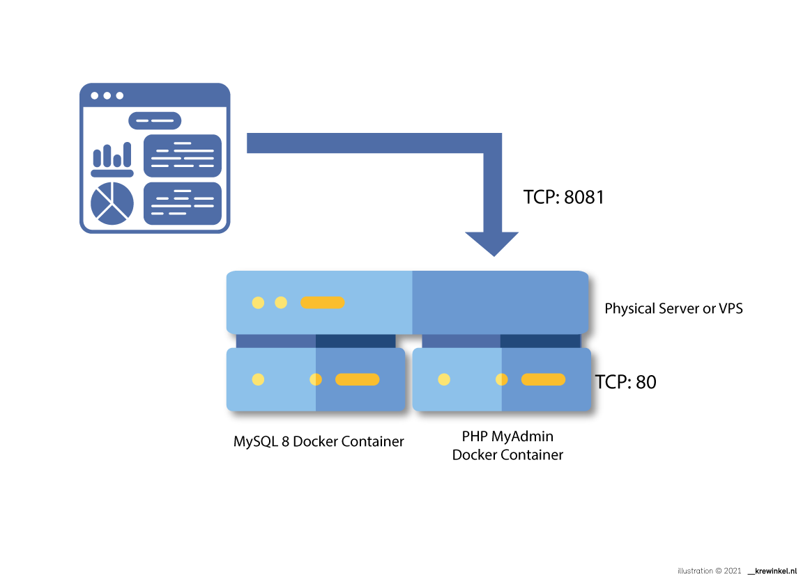

# MySQL inside a docker container

With Docker we can run "single service" containers as Virtual Machines on our network. They are always configured in the right way, so it makes it easy to deploy and redeploy them. 

We are going to setup following architecture: 



First install Docker for your platform.
We are going to use the official Ubuntu setup as described [here](https://docs.docker.com/engine/install/ubuntu/)

Summary: 

Remove old versions
```
$ apt-get remove docker docker-engine docker.io containerd runc
```

Set up repository:
```
$ apt-get update

$ apt-get install \
    apt-transport-https \
    ca-certificates \
    curl \
    gnupg-agent \
    software-properties-common
```

Download & Install the keys: 
```
$ curl -fsSL https://download.docker.com/linux/ubuntu/gpg | sudo apt-key add -

$ apt-key fingerprint 0EBFCD88

pub   rsa4096 2017-02-22 [SCEA]
      9DC8 5822 9FC7 DD38 854A  E2D8 8D81 803C 0EBF CD88
uid           [ unknown] Docker Release (CE deb) <docker@docker.com>
sub   rsa4096 2017-02-22 [S]

add-apt-repository \
   "deb [arch=amd64] https://download.docker.com/linux/ubuntu \
   $(lsb_release -cs) \
   stable"
```


Install the Docker engine:
```
 $ sudo apt-get update
 $ sudo apt-get install docker-ce docker-ce-cli containerd.io
``` 

List versions: 
```
apt-cache madison docker-ce
```

Pick the lastest: 
```
apt-get install docker-ce=<VERSION_STRING> docker-ce-cli=<VERSION_STRING> containerd.io

apt-get install docker-ce=5:20.10.2~3-0~ubuntu-bionic  docker-ce-cli=5:20.10.2~3-0~ubuntu-bionic  containerd.io
```

Now you can start a container (or download an image if you have none):

```bash
docker run -it ubuntu bash
```

This command downloads and runs an Ubuntu container.

Now lets create a permanent image: 
```bash
docker pull mysql:8.0.1
docker run --name mysql8 -e MYSQL_ROOT_PASSWORD=mypass123 -d mysql:8.0.1
```
1. The option `--name` allows us to assign a specific name for our running container.
2. The option `-e` is used to pass a value for the container environment variable `MYSQL_ROOT_PASSWORD`. This variable is requested by the image to run properly and it will be assigned to the root password of MySQL.
3. The option `-d` means that docker will run the container in the background in “detached” mode. If `-d `is not used the container run in the default foreground mode.
4. Finally, we need to indicate docker to use the image `mysql:8.0.1` just downloaded, to run the container.


Check if it's running: 
```bash
docker ps
CONTAINER ID   IMAGE         COMMAND                  CREATED         STATUS         PORTS      NAMES
85c2b6055336   mysql:8.0.1   "docker-entrypoint.s…"   3 seconds ago   Up 2 seconds   3306/tcp   mysql8
```

Now let's pull a PHPMyAdmin Image:

```bash
docker pull phpmyadmin/phpmyadmin:latest
```

Now run this own
```bash
docker run --name phpmyadmin-docker -d --link mysql8:db -p 8081:80 phpmyadmin/phpmyadmin
```

1. The options *`name`* and *`d`* has been explained in the previous section.
2. The option `--link` provides access to another container running in the host. In our case the container is the one created in the previous section, called `mysql8` and the resource accessed is the MySQL db.
3. The mapping between the host ports and the container ports is done using the option `-p` followed by the port number of the host (`8081`) that will be redirected to the port number of the container (80, where the `ngix` server with the phpMyAdmin web app is installed).
4. Finally, the docker run command needs the image used to create the container, so we will use the phpmyadmin image just pulled from docker hub.

Now you can connect to the server you've installed it on on port 8081.
In our case: http://server-f.dba-training.online:8081

User: root
Password: mypass123

you can log in to a container with: 
```bash
$ docker exec -it [CONTAINER] /bin/bash
```
Where `[CONTAINER]` is the name of your container.