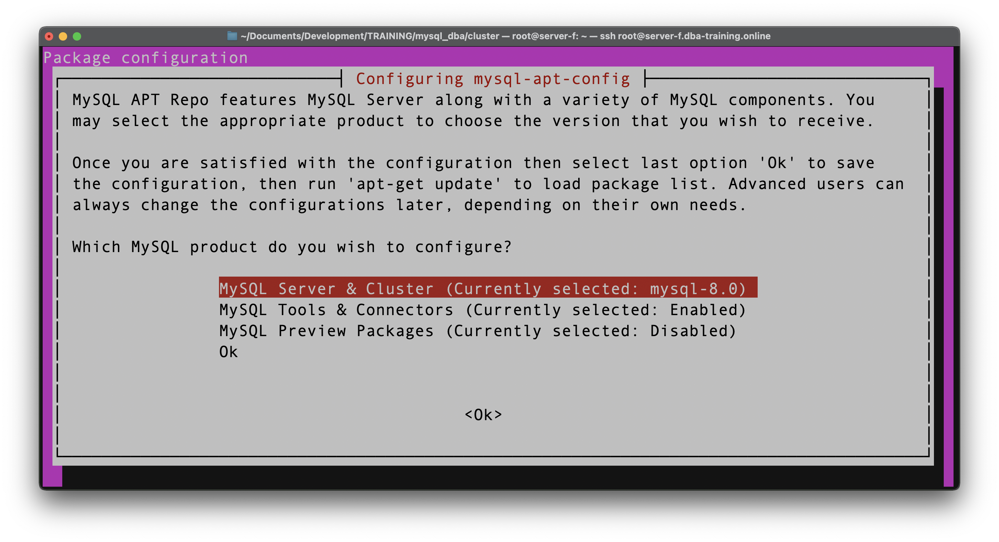
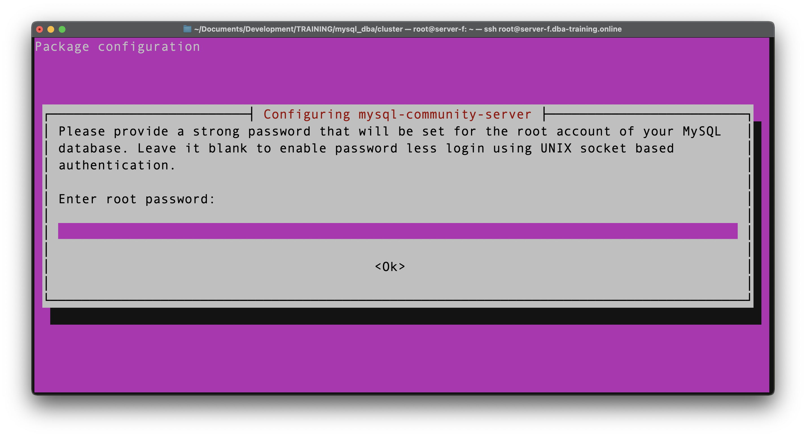

# Migrating to MySQL 8

## 1 - Install MySQL 8 on your specific platform
1. [Ubuntu / Debian Systems](#ubuntu-install)
2. [RedHat Systems](#redhat-install)
3. [Install MySQL Server](#install-mysql-server)

## Ubuntu Install

First make sure you have the latest patches and package repositories installed and if required, reboot your server: 

````
$ apt update
$ apt upgrade
$ reboot 
````
Download the appropriate package DEB package: 
````
wget -c https://dev.mysql.com/get/mysql-apt-config_0.8.11-1_all.deb
````

### Install MySQL Repositories
Install and enable the MySQL Repositories: 
````
$ (sudo) dpkg -i mysql-apt-config_0.8.11-1_all.deb
````
The system should respond by launching an installation configuration tool. It will present options to you for which MySQL version you want to install.

Leave the default settings and click OK, unless you’re an advanced user and have a specific reason to change them.

### Refresh the Repositories
Any time you’re installing new packages, you should update repository listings to ensure you are installing the latest release. In the terminal, enter the following:
```
$ (sudo) apt-get update
```
The system should take a few moments and refresh the repository cache.

### Error?
If you get this error: 
````               
W: GPG error: http://repo.mysql.com/apt/ubuntu bionic InRelease: The following signatures were invalid: EXPKEYSIG 8C718D3B5072E1F5 MySQL Release Engineering <mysql-build@oss.oracle.com>
E: The repository 'http://repo.mysql.com/apt/ubuntu bionic InRelease' is not signed.
N: Updating from such a repository can't be done securely, and is therefore disabled by default.
N: See apt-secure(8) manpage for repository creation and user configuration details.
````
Issue following command to update the keystructure: 
````
apt-key adv --keyserver keys.gnupg.net --recv-keys 8C718D3B5072E1F5
````
This might take a while. You need the specific repository validated, otherwise the system will install MySQL 5.7 instead of version 8.

## RedHat install
bla bla


## Install MySQL Server
To install MySQL run: 
```
$ (sudo) apt-get install mysql-server (ubuntu)
$ (sudo) yum install mysql-server (redhat)
```
apt will look at all available mysql-server packages and determine that the MySQL provided package is the newest and best candidate. It will then calculate package dependencies and ask you to approve the installation. Type y then ENTER. The software will install.

You will be asked to set a root password during the configuration phase of the installation. Be sure to choose a secure password. After you enter it twice and hit ENTER, you will be prompted to configure an authentication plugin. The default of Use Strong Password Encryption is recommended, so hit ENTER to choose it. The installation process will continue until completion.



MySQL should now be installed and running. Let’s check using systemctl:
````
$ systemctl status mysql
````
Output: 
````
● mysql.service - MySQL Community Server
   Loaded: loaded (/lib/systemd/system/mysql.service; enabled; vendor preset: enabled)
   Active: active (running) since Thu 2021-01-21 12:14:41 UTC; 1min 56s ago
     Docs: man:mysqld(8)
           http://dev.mysql.com/doc/refman/en/using-systemd.html
 Main PID: 4597 (mysqld)
   Status: "Server is operational"
    Tasks: 37 (limit: 1151)
   CGroup: /system.slice/mysql.service
           └─4597 /usr/sbin/mysqld

Jan 21 12:14:15 server-f systemd[1]: Starting MySQL Community Server...
Jan 21 12:14:41 server-f systemd[1]: Started MySQL Community Server.
````
Check if we have the correct version: 
````
$ mysql -V
mysql  Ver 8.0.23 for Linux on x86_64 (MySQL Community Server - GPL)
````

### Securing the installation
Optionally you can secure the installation with: 
```
mysql_secure_installation
```
This will ask you for the MySQL root password that you set during installation. Type it in and press `ENTER`. Now we’ll answer a series of yes or no prompts. Let’s go through them:

First, we are asked about the validate password plugin, a plugin that can automatically enforce certain password strength rules for your MySQL users. Enabling this is a decision you’ll need to make based on your individual security needs. Type y and `ENTER` to enable it, or just hit `ENTER` to skip it. If enabled, you will also be prompted to choose a level from 0–2 for how strict the password validation will be. Choose a number and hit `ENTER` to continue.

Next you’ll be asked if you want to change the root password. Since we just created the password when we installed MySQL, we can safely skip this. Hit `ENTER` to continue without updating the password.

The rest of the prompts can be answered yes. You will be asked about removing the anonymous MySQL user, disallowing remote root login, removing the test database, and reloading privilege tables to ensure the previous changes take effect properly. These are all a good idea. Type `y` and hit `ENTER` for each.

The script will exit after all the prompts are answered. Now our MySQL installation is reasonably secured. Let’s test it again by running a client that connects to the server and returns some information.

### Testing if it works
`mysqladmin` is a command line administrative client for MySQL. We’ll use it to connect to the server and output some version and status information:
````
mysqladmin -u root -p version
````

The `-u root` portion tells `mysqladmin` to log in as the MySQL root user, `-p` instructs the client to ask for a password, and version is the actual command we want to run.

The output will let us know what version of the MySQL server is running, its uptime, and some other status information:

````
mysqladmin  Ver 8.0.23 for Linux on x86_64 (MySQL Community Server - GPL)
Copyright (c) 2000, 2021, Oracle and/or its affiliates.

Oracle is a registered trademark of Oracle Corporation and/or its
affiliates. Other names may be trademarks of their respective
owners.

Server version		8.0.23
Protocol version	10
Connection		Localhost via UNIX socket
UNIX socket		/var/run/mysqld/mysqld.sock
Uptime:			3 min 59 sec

Threads: 2  Questions: 8  Slow queries: 0  Opens: 643  Flush tables: 4  Open tables: 36  Queries per second avg: 0.033
````

## 2 - Database Migration